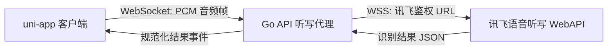

# 实时语音听写功能设计需求文档

版本：V0.1  
日期：2026-06-19  
适用对象：产品、设计、前端、后端、测试、运维  
依赖能力：讯飞开放平台「语音听写（流式版）WebAPI」

## 1. 背景与目标

教师在课间、放学后和家校沟通整理时，经常需要快速记录口头信息，例如学生表现、家长反馈、临时待办和个人情绪记录。手动输入在移动端成本高，也容易打断老师原本的思路。

本功能在 App 底部提供一个高亮圆形语音按钮，点击后启动实时语音听写，把老师正在说的话持续识别为文字，并以“边说边返回”的方式展示结果。V0.1 聚焦短时、高频、轻量记录，不做长会议转写。

## 2. 产品定位

### 2.1 功能定位

实时语音听写是「微光老师」的全局输入增强能力，不替代现有页面，而是作为底部悬浮入口，帮助老师在任何核心模块快速生成可编辑文字。

优先服务以下场景：

| 场景 | 目标 |
| --- | --- |
| 家校沟通 | 口述沟通记录、家长反馈、后续跟进事项 |
| 日程提醒 | 快速创建待办或提醒草稿 |
| 疗愈树洞 | 低负担口述情绪和复盘 |
| 首页工作台 | 临时记录当天要处理的事项 |

### 2.2 本期目标

- 支持中文普通话和英文两种听写模式。
- 实时返回识别结果，用户说话过程中持续看到文字变化。
- 在 App 底部新增高亮圆形按钮，点击进入语音转写。
- 转写结果可复制、清空，并可插入到当前业务场景的文本输入或保存为草稿。
- 使用讯飞语音听写（流式版）WebAPI 实现实时识别。

### 2.3 非目标

- 不做多人会议、课堂整节录音、长音频文件转写。
- 不做说话人分离、情绪识别、自动摘要和 AI 改写。
- 不默认保存原始音频。
- 不在客户端存放讯飞 APISecret。

## 3. 用户与使用场景

### 3.1 核心用户

- 小学、初中、幼儿园教师。
- 高频处理家校沟通、班级事务、个人复盘的老师。
- 移动端输入不便、希望快速把口头想法变成文字的用户。

### 3.2 核心用户故事

- 作为班主任，我想口述“今天小明上课频繁离座，已提醒一次，周五前跟进家长”，App 能实时转成文字并插入沟通记录。
- 作为老师，我想在课间说出“下午三点提醒我收数学作业”，App 能先形成文本草稿，后续再转为提醒。
- 作为用户，我想在疗愈树洞中口述心情，避免手动打字造成额外负担。

## 4. 功能范围

### 4.1 全局底部语音按钮

在 App 底部导航上方居中添加一个高亮圆形按钮。

设计要求：

| 项 | 要求 |
| --- | --- |
| 位置 | 固定在底部导航上方，横向居中；避开安全区和 TabBar 点击区 |
| 尺寸 | 移动端建议 112rpx 到 124rpx；桌面/H5 宽屏可收敛为 56px 到 64px |
| 视觉 | 使用暖金到青蓝的高亮渐变，保持与现有微光玻璃质感一致 |
| 图标 | 麦克风图标，按钮内不放长文本 |
| 状态 | 空闲、连接中、听写中、暂停/结束中、失败 |
| 动效 | 听写中显示轻量脉冲环和声波反馈，不造成底部导航布局跳动 |
| 可达性 | 按钮语义为“开始语音听写”；听写中语义切换为“结束语音听写” |

状态定义：

| 状态 | UI 表现 | 点击行为 |
| --- | --- | --- |
| 空闲 | 高亮圆形按钮，麦克风图标 | 打开听写面板并请求麦克风权限 |
| 连接中 | 按钮轻微呼吸，面板显示“正在连接听写服务” | 可取消 |
| 听写中 | 按钮外圈脉冲，面板实时展示文字 | 停止并发送结束帧 |
| 结束中 | 禁用按钮，等待最终结果 | 不允许重复点击 |
| 失败 | 按钮短暂红色提示，面板展示错误和重试 | 重试或关闭 |

### 4.2 听写面板

点击底部语音按钮后，从底部弹出听写面板。

面板内容：

- 顶部：状态文案、计时器、关闭按钮。
- 语言切换：中文普通话 / English。
- 实时结果区：展示最终文本和临时修正文本。
- 操作区：重新开始、复制、插入当前页面、保存草稿。

交互要求：

- 首次进入需要系统麦克风授权，授权前不启动录音。
- 识别结果必须可编辑，用户可以手动修正后再插入或保存。
- 中文模式开启动态修正时，临时文字被替换时不闪屏、不跳行。
- 英文模式不展示中文动态修正提示。
- 用户关闭面板时，如果已有未处理文本，需要二次确认“保留草稿 / 放弃”。

### 4.3 语言支持

| 模式 | 讯飞参数 | 说明 |
| --- | --- | --- |
| 中文普通话 | `language=zh_cn`、`accent=mandarin`、`domain=iat` | 默认模式，支持简单英文识别；建议开启动态修正 `dwa=wpgs` |
| 英文 | `language=en_us`、`accent=mandarin`、`domain=iat` | 适合英语口述；不使用中文动态修正 |

中文普通话为默认语言。系统应记住用户上一次选择的语言，仅保存在本地偏好中。

### 4.4 实时结果展示

结果分为两层：

- 最终文本：已经稳定确认的文字。
- 临时文本：服务端仍可能修正的文字，用浅色或下划线状态展示。

中文动态修正处理：

- 当讯飞返回 `pgs=apd` 时，将当前片段追加到最终文本。
- 当讯飞返回 `pgs=rpl` 时，根据 `rg` 替换指定序号范围内的历史片段。
- 前端需要维护 `sn -> text` 的片段列表，再拼接成完整显示文本。

英文结果处理：

- 按返回顺序追加识别片段。
- 根据标点返回结果更新展示，不做中文动态替换逻辑。

### 4.5 结果去向

V0.1 支持四类结果去向：

| 入口页面 | 默认动作 | 说明 |
| --- | --- | --- |
| 家校沟通 | 插入沟通记录输入框 | 若当前有家长档案上下文，带入对应家长 |
| 日程 | 插入提醒标题或备注草稿 | 不自动创建提醒，避免误操作 |
| 疗愈 | 插入树洞文本 | 由用户确认保存 |
| 其他页面 | 保存为语音草稿 | 可在个人中心或后续入口查看 |

## 5. 关键流程

### 5.1 首次使用流程

1. 用户点击底部高亮圆形麦克风按钮。
2. App 弹出听写面板并请求麦克风权限。
3. 用户授权后，前端建立与后端的听写 WebSocket 会话。
4. 后端创建讯飞 WebSocket 连接并完成鉴权。
5. 前端开始采集音频，按帧上传。
6. 后端转发音频到讯飞，并把识别结果实时推送给前端。
7. 用户点击停止后，前端发送结束指令，后端发送最后一帧 `status=2`。
8. 前端收到最终结果后，用户选择插入、复制或保存草稿。

### 5.2 非首次使用流程

1. 用户点击按钮。
2. 听写面板直接进入语言选择和连接状态。
3. 若系统权限仍有效，直接开始录音和实时识别。
4. 若权限被撤销，展示权限引导。

### 5.3 异常流程

| 异常 | 处理 |
| --- | --- |
| 用户拒绝麦克风权限 | 展示“需要麦克风权限才能听写”，提供重新授权指引 |
| 网络断开 | 停止录音，保留已识别文本，提示重试 |
| 讯飞鉴权失败 | 提示服务暂不可用，记录后端错误日志，不暴露密钥信息 |
| 超过单次时长 | 自动结束当前会话，保留文本，并提示可重新开始 |
| 长时间静音 | 根据 `eos` 策略自动结束或提示“没有检测到声音” |
| 并发或额度不足 | 提示“听写服务繁忙”，保留本地文本，不丢失用户输入 |

## 6. 技术方案

### 6.1 推荐架构

采用“客户端采集音频 + 后端代理讯飞”的方案。



选择原因：

- 讯飞 `APISecret` 不进入客户端。
- 后端可统一做鉴权、限流、并发控制、额度统计和错误审计。
- 未来可以在后端扩展热词、用户词表、草稿保存和 AI 整理。

### 6.2 客户端职责

- 管理底部按钮、听写面板、语言偏好和交互状态。
- 请求麦克风权限并采集音频。
- 将音频转换为 16k 或 8k、16bit、单声道 PCM。
- 按约定帧大小发送音频数据到后端。
- 接收后端实时识别事件并渲染最终/临时文本。
- 在页面上下文中完成插入、复制、保存草稿。

平台建议：

| 平台 | 采集方式 |
| --- | --- |
| H5 | `navigator.mediaDevices.getUserMedia` + Web Audio 采样转换 |
| App | `uni.getRecorderManager()` 录制 16k 单声道 PCM 短分片，约 280ms 一段，读出临时文件后切成约 40ms PCM 小帧，通过同一 WebSocket 发送，并自动开启下一段 |
| 小程序 | 小程序录音管理器；若不能直接输出 PCM，需要后端或插件转码 |

App 端说明：

- DCloud App 端 `RecorderManager.onFrameRecorded` 不提供稳定实时帧回调，因此 V0.1 采用短 PCM 分片循环作为 App 兼容方案。
- 单段时长默认约 280ms，客户端读出 PCM 后再按 1280B 小帧节奏发送；服务端仍保持同一个讯飞 WebSocket 会话，按 `status=0/1/2` 连续发送，达到接近边说边返回的体验。
- App 包必须声明麦克风权限：Android `android.permission.RECORD_AUDIO`，iOS `NSMicrophoneUsageDescription`。
- 若后续引入原生录音插件并能稳定输出 40ms PCM 帧，可在不改变后端协议的前提下替换客户端录音器。

### 6.3 后端职责

- 新增听写 WebSocket 入口，例如 `GET /api/v1/dictation/stream`。
- 校验登录态、用户权限、频率和并发。
- 根据用户选择的语言生成讯飞业务参数。
- 使用 AppID、APIKey、APISecret 生成讯飞鉴权 URL。
- 连接讯飞 `wss://iat-api.xfyun.cn/v2/iat`。
- 接收客户端音频帧，转换为讯飞要求的 JSON 帧并 base64 编码音频。
- 解析讯飞返回结果，转换为统一事件推给客户端。
- 记录会话指标，不保存原始音频。

### 6.4 讯飞接口要点

根据讯飞开放平台「语音听写（流式版）WebAPI」文档：

| 项 | 要求 |
| --- | --- |
| 协议 | WebSocket，推荐 WSS |
| 推荐地址 | `wss://iat-api.xfyun.cn/v2/iat` |
| 鉴权 | HMAC-SHA256 签名，URL query 携带 `authorization`、`date`、`host` |
| 音频属性 | 8k 或 16k、16bit、单声道 |
| 音频格式 | `raw` PCM；中文普通话和英文也支持 mp3 |
| 单次时长 | 最长 60 秒 |
| 空闲限制 | 超过 10 秒未发送数据，服务端会主动断开 |
| 推荐发送 | PCM 每 40ms 发送 1280B 音频 |
| 帧状态 | `status=0` 第一帧、`status=1` 中间帧、`status=2` 最后一帧 |
| 中文动态修正 | 中文普通话可设置 `dwa=wpgs` |

V0.1 默认使用 PCM `raw`，采样率优先 16k。H5 端按约 40ms PCM 帧发送；App 端使用 280ms PCM 分片循环，并二次切成 40ms 小帧发送，保障原生 App 可用。

### 6.5 后端环境变量

新增环境变量建议：

| 变量 | 说明 |
| --- | --- |
| `XF_ASR_APP_ID` | 讯飞 AppID |
| `XF_ASR_API_KEY` | 讯飞 APIKey |
| `XF_ASR_API_SECRET` | 讯飞 APISecret |
| `XF_ASR_ENDPOINT` | 默认 `wss://iat-api.xfyun.cn/v2/iat` |
| `XF_ASR_MAX_SESSION_SECONDS` | 默认 55，低于讯飞 60 秒上限以预留收尾 |
| `XF_ASR_MAX_CONCURRENT_PER_USER` | 单用户并发上限，默认 1 |
| `XF_ASR_DAILY_LIMIT_PER_USER` | 单用户每日调用上限 |

### 6.6 前后端事件协议

客户端到后端：

```json
{ "type": "start", "language": "zh_cn", "sampleRate": 16000 }
```

```json
{ "type": "audio", "seq": 12, "audio": "base64-pcm-chunk" }
```

```json
{ "type": "stop" }
```

后端到客户端：

```json
{ "type": "ready", "sessionId": "dict_..." }
```

```json
{
  "type": "partial",
  "sn": 3,
  "text": "今天小明",
  "stableText": "今天",
  "unstableText": "小明"
}
```

```json
{
  "type": "final",
  "text": "今天小明上课频繁离座，已提醒一次。"
}
```

```json
{ "type": "error", "code": "XF_ASR_TIMEOUT", "message": "听写超时，请重新开始。" }
```

## 7. 数据与隐私

### 7.1 数据保存

- 默认只保存用户确认后的文本草稿或插入后的业务记录。
- 不保存原始音频。
- 后端仅记录必要审计字段：用户 ID、会话 ID、开始/结束时间、语言、时长、成功/失败、错误码、字符数。
- 错误日志不得记录完整识别文本，最多保留截断摘要用于排障。

### 7.2 权限与告知

- 首次使用前明确提示“语音将用于实时转写为文字”。
- 需要系统麦克风权限。
- 结果保存必须由用户主动确认。
- 隐私政策需补充第三方语音识别服务提供方为讯飞开放平台。

### 7.3 安全要求

- 讯飞密钥只存服务端环境变量。
- 生产环境禁止打印鉴权 URL、APISecret、完整音频帧。
- WebSocket 必须校验登录态。
- 单用户同一时间只允许一个活跃听写会话。
- 后端需设置消息大小上限和会话时长上限。

## 8. 体验指标与验收标准

### 8.1 体验指标

| 指标 | 目标 |
| --- | --- |
| 首字返回时间 | 正常网络下小于 2 秒 |
| 中间结果刷新 | 说话过程中持续返回，不等整句结束 |
| 单次听写时长 | 自动控制在 55 秒内，避免触达 60 秒硬上限 |
| 文本丢失率 | 网络错误、关闭面板时不丢失已识别文本 |
| 入口可见性 | 底部圆形按钮在 5 个 Tab 页面均可见 |

### 8.2 功能验收

- 在首页、疗愈、沟通、日程、我的页面都能看到底部高亮圆形语音按钮。
- 点击按钮后能请求麦克风权限并打开听写面板。
- 中文普通话模式下，说一句中文，文字能实时出现，并能根据动态修正更新。
- 英文模式下，说一句英文，文字能实时出现。
- 停止听写后能得到最终文本。
- 结果能复制、清空、插入当前页面或保存为草稿。
- 单次听写接近 55 秒时自动结束并提示。
- 网络断开或讯飞错误时，已识别文本仍保留。
- 未登录用户点击按钮时进入登录流程或提示登录。

### 8.3 技术验收

- 后端不向客户端暴露 `XF_ASR_API_SECRET`。
- 后端能正确生成讯飞鉴权 URL 并建立 WSS 连接。
- 音频帧按 `status=0/1/2` 顺序发送，结束时必发 `status=2`。
- PCM 帧 base64 后大小不超过讯飞限制。
- 中文动态修正 `pgs=rpl` 和 `pgs=apd` 均有单元测试覆盖。
- WebSocket 会话超时、主动停止、异常断开均能释放资源。
- 配置缺失时服务启动或接口调用能给出明确错误。

## 9. 设计细节

### 9.1 按钮视觉

按钮应延续现有 App 的温柔、轻盈、玻璃质感，但要成为底部明确入口。

建议样式：

- 主体：圆形，渐变 `#ffbf6b -> #66c7d8`。
- 图标：白色麦克风，居中。
- 阴影：柔和外发光，避免厚重投影。
- 听写中：外圈 2 到 3 层脉冲环，透明度循环。
- 错误时：短暂切换为浅红描边，不持续制造焦虑。

### 9.2 面板视觉

- 底部抽屉高度默认 56vh，内容多时可上拉到 86vh。
- 顶部用胶囊分段控件切换语言。
- 实时文本区为主视觉，不使用说明型大段文字。
- 最终文本用深色，临时文本用较浅色。
- 操作按钮保持克制：停止为主按钮，复制/插入/保存为次操作。

### 9.3 文案建议

| 场景 | 文案 |
| --- | --- |
| 空闲 | 点一下，说出来 |
| 连接中 | 正在连接听写服务 |
| 听写中 | 正在听，你可以继续说 |
| 静音 | 没有听到声音，可以靠近一点再试 |
| 自动结束 | 已到单次听写时长，文字已为你保留 |
| 权限拒绝 | 需要麦克风权限，才能把声音转成文字 |

## 10. 埋点与运营指标

建议埋点：

| 事件 | 字段 |
| --- | --- |
| `dictation_button_click` | page、user_id、entry_context |
| `dictation_permission_result` | granted、platform |
| `dictation_session_start` | language、page |
| `dictation_first_result` | latency_ms、language |
| `dictation_session_stop` | duration_ms、chars、reason |
| `dictation_insert` | target_page、chars |
| `dictation_error` | code、stage、language |

核心指标：

- 语音按钮点击率。
- 听写启动成功率。
- 首字延迟 P50/P90。
- 听写结果插入率。
- 听写错误率。
- 单用户日均听写次数。

## 11. 测试计划

### 11.1 产品测试

- 普通话短句、长句、停顿、带标点语气。
- 英文短句、教学常用英文表达。
- 中英混说在中文模式下的表现。
- 静音、噪声、背景音乐、多人说话。
- 关闭面板、切换 Tab、App 退后台。

### 11.2 技术测试

- 讯飞鉴权 URL 生成测试。
- WebSocket 正常开始、停止、超时、断网重连测试。
- 音频采样率和声道转换测试。
- 动态修正结果合并测试。
- 用户并发限制和每日额度限制测试。
- App 端构建包检查麦克风权限声明，真机验证首次授权、拒绝授权、短分片连续转写和退后台停止录音。
- H5、App、小程序平台差异测试。

### 11.3 回归测试

- 底部按钮不遮挡 TabBar。
- 原有 5 个 Tab 页面滚动和点击不受影响。
- 首页、沟通、日程、疗愈现有输入框功能不受影响。
- 未配置讯飞密钥时，其他 App 功能仍可正常使用。

## 12. 里程碑建议

| 阶段 | 目标 | 交付 |
| --- | --- | --- |
| P0 原型验证 | 跑通 H5 麦克风采集、后端代理、讯飞实时返回 | 内部 demo、接口联调记录 |
| P1 MVP | 全局底部按钮、听写面板、中文/英文实时转写 | 可测试版本 |
| P2 场景打通 | 插入沟通记录、日程草稿、树洞文本 | 业务闭环 |
| P3 稳定性 | 限流、埋点、错误兜底、隐私文案 | 发布候选 |

## 13. 开放问题

- App 端是否优先发布 H5 能力，还是同步支持原生 App 和小程序。
- 草稿列表入口放在个人中心，还是放在听写面板历史中。
- 是否需要为教师常见姓名、班级、学科增加讯飞热词。
- 中文模式是否允许“中英文混说”作为默认体验，还是提供独立英文模式优先。
- 免费用户每日听写次数和 Pro 用户权益边界如何设定。

## 14. 参考资料

- 讯飞开放平台：语音听写（流式版）WebAPI 文档，`https://www.xfyun.cn/doc/asr/voicedictation/API.html`
